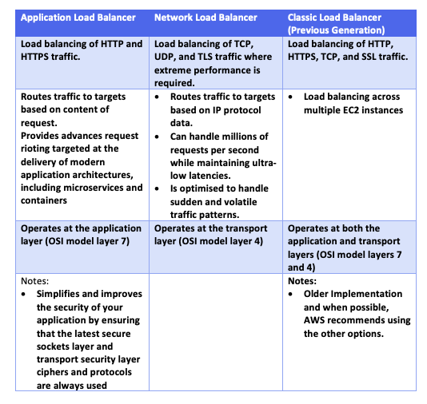
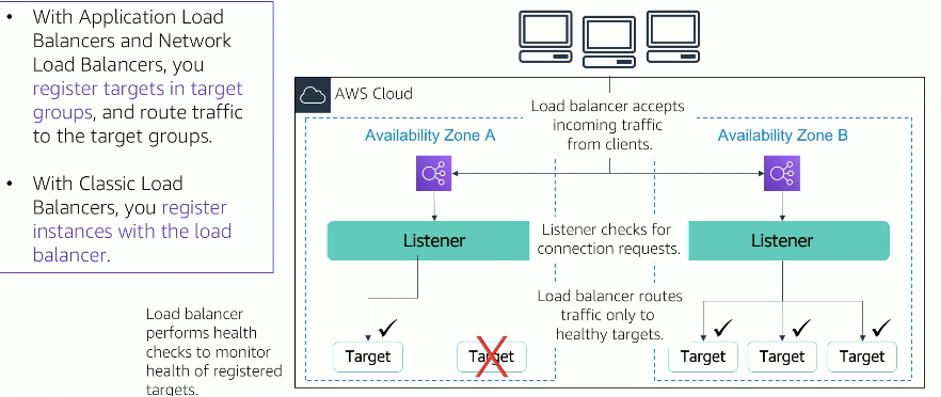
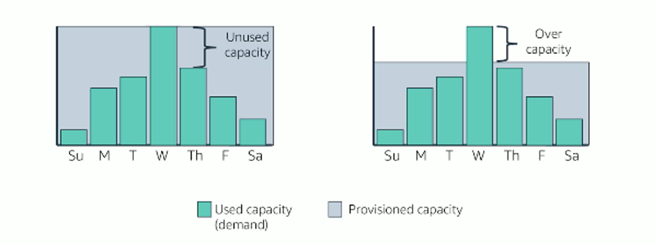

# Load Balancing and Auto Scaling Groups

## What is Load Balancing?
* Distributing network traffic across servers.
* This is because modern websites may need to serve  thousands or millions of concurrent requests and then return text, images, videos etc.
* To meet high volume demands, additional servers are generally required
* A load balancer has the following functions:
  * Distribute network traffic
  * Ensure high availability by only routing to available servers.
  * Flexibly add or remove servers to meet demand. 

## Elastic Load Balancing
* AWS service that distributes incoming application or network traffic across multiple targets, such as EC2 instances, containers, IP addresses, and lambda
functions, in a single AZ or across multiple AZs.
* Scales your load balancer as traffic to your application changes over time
* Can automatically scale to most workloads

## Types of Load Balancers

## How Elastic Load Balancing Works?

* Load balancer accepts incoming traffic clients, and routes requests to its registered targets in one or more AZs
* Can configure your load balancer to accept incoming traffic by specifying one or more listeners.
* A listener is a process that checks for connection requests. Configured with a protocol, like HTTP, and a port number, such as port 80.
* Similarly, it is configured with a protocol and a port number for connections from the load balancers to the target.
* Can also configure your load balancer to perform health checks, which are used to monitor the health of the registered targets so that the load balancer only sends requests o the health instance.
* When load balancer detects an unhealthy instance, it stops routing traffic to that target
* Key difference in how the load balancer types are configured
* With an application network load balancer, you register targets in target groups, and route traffic to the target groups
* With classic load balancers, you register instances with the load balancer

## Elastic Load Balancing Use Cases

* Highly available and fault-tolerant applications
  * Balances traffic across healthy targets in multiple AZ
  * If one or more of your targets is in a single AZ and unhealthy
  * ELB will route target traffic to healthy targets in other AZ
  * After the target returns to a healthy state, ELB will automatically resume traffic to them
* Containerised applications
  * Can use a load balancer to automatically load balance your containerised application across multiple ports on the same EC2 instance
  * Can also take advantage of deep integration with Amazon Elastic Container Service which provides a fully managed container offering  
  * You only have to register a service with a load balancer and Amazon ECS transparent manages registration and deregistration of Docker.
  * The load balancer automatically detect the port and dynamically reconfigures itself.

# Amazon EC2 Auto Scaling
## Why is Scaling important?

* Scaling is the ability to increase or decrease the compute capacity of your application.
* Automatic scaling important when capacity varies during the week. As show in the figure, you provision capacity which may be too much or too little for the demands of the week. It is necessary to have automatic scaling to support fluctuating demand.

## Auto-Scaling
* Helps you maintain application availability
* Enables you to automatically add or remove EC2 instances according to conditions you define
* Can use the Fleet Management features of EC2 auto scaling to maintain the health and availability of your fleet.
* Detects impaired EC2 instances and unhealthy applications, and replaces the instances without your intervention
* Provides several scaling operations-
  * Manual
  * Scheduled
  * Dynamic or on-demand
  * Predictive
  * Dynamic and predictive can be used together for faster scaling

## What are Auto-Scaling Groups?
* An auto scaling group is a collection of EC2 instanced that are treated as a logical grouping for the purposes of automatic scaling and management.

* Size of the auto scaling group depends on the number of instances you configure as the desired capacity.
* Can adjust size to meet demand manually or using automatic scaling
* Can specify the minimum number of instances in each auto scaling group and Amazon EC2 Auto Scaling will prevent your group form going below that size. Likewise, can specify maximum number of instances.
* If you specify the desired capacity, EC2 Auto Scaling will adjust the size of the group so it has the specified number of instances.
* Scaling Out = Launching instances
* Scaling in = Terminating instances

## What is High Availability?
* High level of operational performance
* Minimised downtime
* No human intervention
